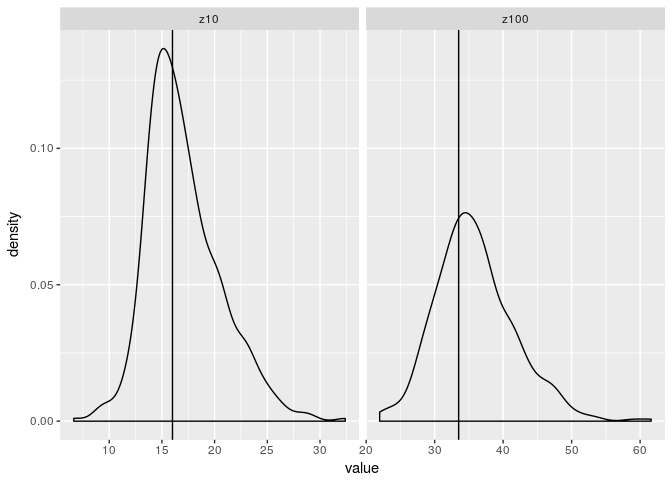

Black Sea PAR attenuation
================
Arthur Capet
November 20, 2018

The ArgoDiva Toolbox framework.
===============================

We use the usual toolbox workflow :

-   Load data
-   Define functions and apply on all profiles
-   Analyses/manipulate the results

Data Load
=========

We used here Argo profiles from the Coriolis websiste as collected until ~early 2018. 3 floats have "Downwelling Irradiance" as a variable. We did not analyse spatial/temporal coverage at this stage.

    FALSE [1] "6900807_Mprof.nc"
    FALSE [1] "DOWNWELLING_PAR"
    FALSE [1] "vobjtovarid4: error #F: I could not find the requsted var (or dimvar) in the file!"
    FALSE [1] "var (or dimvar) name: DOWNWELLING_PAR_ADJUSTED"
    FALSE [1] "file name: ../../Datas/Coriolis_PAR/6900807_Mprof.nc"
    FALSE [1] "6901866_Mprof.nc"
    FALSE [1] "DOWNWELLING_PAR"
    FALSE [1] "7900591_Mprof.nc"
    FALSE [1] "DOWNWELLING_PAR"
    FALSE [1] "7900592_Mprof.nc"
    FALSE [1] "DOWNWELLING_PAR"

Function evaluation
===================

The toolbox allows to evaluate functions on each value or each profile. In this case, the functions evaluated on each profile returns

-   optical parameters that reproduce at best the observed PAR profile.

-   depth of 1% and 10% of surface incoming light level (evaluated in the upper 1m).

Since Argo records PARvalues, the following parameters are to be used for the PAR only fraction . We are thus **NOT** considering IR fraction or attenuation here. As Luc mentionned, the IR attenuation doesn't matter with a 5m upper cell, it will all be absorbed anyway.

There are 4 parameters for the remaining 2-band PAR attenuation model.
*P**A**R*(*z*)=*P**A**R*<sub>0</sub>\[*p*<sub>*s*</sub>.*e*<sup>−*k*<sub>*s*</sub>*z*</sup> + (1 − *p*<sub>*s*</sub>)*e*<sup>−*k*<sub>*l*</sub>*z*</sup>\]

-   *P**A**R*<sub>0</sub> : is left free for each individual profile calibration. Avoiding this would mean to collect surface PAR at each float location from external sources, eg. from ECMWF fields (short-wave and cloud), and assuming a fixed PAR proportion for surface incoming light.

-   *p*<sub>*s*</sub> : is fixed to better contrain the other parameters. I used the 0.37 value that we were discussing.

-   *k*<sub>*s*</sub> and *k*<sub>*l*</sub> : are the main targetted parameters here.

The procedure returns a dataframe. The summary below gives an idea of the calibrated parameter distribution statistics.

``` r
########################
# Complete (by level)  #
#      and / or        #
# Extract (by profile) #
########################
# Here we use the cast function to retain only a single entry per "id variable" (see formula below)
ddi  <- dcast(fulldf,qc+depth+juld+lon+lat+Platform+day+month+year~variable,fun.aggregate = mean, na.rm=T)
ddin <- subset(ddi,!is.na(PAR) & PAR > 0 & qc ==0)
ddim <- melt(ddin,id.vars = c("qc","depth","juld","lon","lat","Platform","day","month","year"))

flist   <- list("isoPAR","PAR2bands")

finaldf <- ArgoExtractForCastDF(ddin, flist )
finaldf <- melt(finaldf, id.vars = c("qc","juld","lon","lat","Platform","day","month","year"))
finaldffrop<-dcast(finaldf,qc+juld+lon+lat+Platform+day+month+year~variable, fun.aggregate = mean, na.rm=TRUE)

summary(finaldffrop)
```

    FALSE        qc         juld            lon             lat       
    FALSE  Min.   :0   Min.   :23359   Min.   :28.43   Min.   :41.41  
    FALSE  1st Qu.:0   1st Qu.:23515   1st Qu.:30.66   1st Qu.:42.07  
    FALSE  Median :0   Median :24106   Median :32.91   Median :42.46  
    FALSE  Mean   :0   Mean   :24059   Mean   :33.49   Mean   :42.54  
    FALSE  3rd Qu.:0   3rd Qu.:24491   3rd Qu.:36.41   3rd Qu.:43.09  
    FALSE  Max.   :0   Max.   :24887   Max.   :38.78   Max.   :44.29  
    FALSE                              NA's   :2       NA's   :2      
    FALSE    Platform              day            month             year     
    FALSE  Length:471         Min.   : 1.00   Min.   : 1.000   Min.   :2013  
    FALSE  Class :character   1st Qu.: 8.00   1st Qu.: 3.000   1st Qu.:2014  
    FALSE  Mode  :character   Median :16.00   Median : 6.000   Median :2016  
    FALSE                     Mean   :15.97   Mean   : 6.299   Mean   :2015  
    FALSE                     3rd Qu.:24.00   3rd Qu.:10.000   3rd Qu.:2017  
    FALSE                     Max.   :31.00   Max.   :12.000   Max.   :2018  
    FALSE                                                                    
    FALSE       z10              z100            PAR0               ks0         
    FALSE  Min.   : 6.632   Min.   :21.97   Min.   :   0.137   Min.   :0.06441  
    FALSE  1st Qu.:14.508   1st Qu.:32.10   1st Qu.: 379.236   1st Qu.:0.26844  
    FALSE  Median :16.426   Median :35.31   Median : 719.009   Median :0.37733  
    FALSE  Mean   :17.064   Mean   :35.91   Mean   : 835.928   Mean   :0.53672  
    FALSE  3rd Qu.:18.983   3rd Qu.:39.12   3rd Qu.:1292.506   3rd Qu.:0.54944  
    FALSE  Max.   :32.391   Max.   :61.61   Max.   :2500.000   Max.   :3.00000  
    FALSE  NA's   :11       NA's   :11      NA's   :90         NA's   :90       
    FALSE       kl0        
    FALSE  Min.   :0.0000  
    FALSE  1st Qu.:0.1103  
    FALSE  Median :0.1293  
    FALSE  Mean   :0.1317  
    FALSE  3rd Qu.:0.1496  
    FALSE  Max.   :0.3485  
    FALSE  NA's   :90

About 90 out of 471 calibrations did not converge. I don't know why.. there are probably ways to adress this with a bit more time involved (cf. nls function)

Visualisation of the identified paramter distribution
=====================================================

1.  All together to have an idea of the spread


1.  Grouped by month to check that there is no overwhelming seasonal variability (except the one expected for PAR0)


Check
=====

For a check with actual Argo PAR data (colors below), we first reconstructed typical PAR0 value for each month (the mean and 0.5, 1.5 times the mean). We then evaluated light profiles using the unique parameter values (black lines).

The calibrated parameters (medians of the above distribution) are :

-   *k*<sub>*s*</sub> = 0.3773313

-   *k*<sub>*l*</sub> = 0.1292478

``` r
zforp <- seq(0.5,100,.5)

sumfinaldf <- ddply(finaldffrop, .(month),summarize, meanP0=mean(PAR0, na.rm=T))

ksfinal<-median(finaldffrop$ks0, na.rm=TRUE)
klfinal<-median(finaldffrop$kl0, na.rm=TRUE)

PARCOMP <-ddply(sumfinaldf,.(month), function(dsub){
 data.frame(PAR=c( Att_2band(zforp,dsub$meanP0,       ksfinal,klfinal),
                   Att_2band(zforp,dsub$meanP0*0.5,   ksfinal,klfinal),
                   Att_2band(zforp,dsub$meanP0*1.5,   ksfinal,klfinal)),
                            depth=c(zforp,zforp,zforp), 
            group=c(rep(1,length(zforp)),rep(2,length(zforp)) ,rep(3,length(zforp))  ),
            month=dsub$month)})

ggplot(ddin,aes(x=PAR, y=-depth, color=factor(month)))+
  geom_point()+xlim(c(0,2000))+ylim(c(-80,0))+
  facet_wrap(~month, scales = "free_x", ncol=2)+
  geom_line(aes(group=group),data = PARCOMP, color="black")
```


Same in Log10

``` r
ggplot(ddin,aes(x=PAR, y=-depth, color=factor(month)))+
  geom_point()+xlim(c(0.001,2000))+ylim(c(-150,0))+
  facet_wrap(~month, ncol=2)+
  geom_line(aes(group=group),data = PARCOMP, color="black")+scale_x_log10()
```

    FALSE Scale for 'x' is already present. Adding another scale for 'x', which
    FALSE will replace the existing scale.


BIAS
====

To estimate the bias, I computed mean monthly profile from the Argos, and compared them to modelled light penetration obtained with the surface value.

On the plot below, X axis is the bias (Model - mean profile).

``` r
ddin2 <- ddin
ddin2$depth  <- 0.5*(round(ddin2$depth*2)) 
dbias <- ddply(ddin2, .(month,depth), summarise, PAR=mean(PAR, na.rm=TRUE))
dbias <- ddply(dbias, .(month), mutate, BIAS = Att_2band(depth, interp1(depth,PAR,1), ksfinal,klfinal, depthP0=1)-PAR)
ggplot(dbias, aes(x=BIAS, y=-depth, color=factor(month)))+
  geom_point()+facet_wrap(~month)+ylim(c(-100,0))+xlim(c(-200,200))
```


Iso-lumes
=========

Now, an attempt to compare the 1% an 10% isolume derived from Argo and re-modelled light profile.
Remember, we use here the 1% and 10% of the 1 m light value (0 rarely available for Argos). The vertical lines indicate the z10 and z100 from the recalibrated model (which does not change with season).

``` r
PARCOMPiso  <- ddply(subset(PARCOMP,group==1),.(month), function(dsub){
                        p0   <- dsub[which(dsub$depth==1),"PAR"]
                        z10  <- dsub[which.min(abs(dsub$PAR-p0/10)),"depth"]
                        z100 <- dsub[which.min(abs(dsub$PAR-p0/100)),"depth"]
                        return(data.frame(z10=z10,z100=z100))})


ggplot(subset(finaldf, variable %in% c('z10','z100')),aes(x=value))+
  geom_density()+ facet_wrap(~variable, scales = "free_x", ncol=2)+
  geom_vline(data=melt(PARCOMPiso, id.vars = "month"),aes(xintercept = value))
```



``` r
ggplot(subset(finaldf, variable %in% c('z10','z100')),aes(x=value, color=factor(month)))+
  geom_density()+ facet_wrap(~variable, scales = "free_x", ncol=2)+
  geom_vline(data=melt(PARCOMPiso, id.vars = "month"),aes(xintercept = value))
```


Conclusion
==========

Those parameters should be used for the PAR part of incoming radiation, when no additional "bio" attenuation terms are involved. They represent "optimal.." spatially and seasonally constant attenuation constants for two spectral bands representing respectively 0.37 and 0.63 of the incoming PAR radiation.

There seems to be a systematic underestimation of underwater PAR, particularly in summer. Obviously the simplified 2-band, constant attenuation paradigm cannot allow seasonal fluctuation in the 1 and 10% light peneatration depth. However, we may expect to have a balance between overestimation and underestimation periods. One reason why we tend to have mostly overestimation of the attenuation might be that surface (high) value weights more on the fitting procedure, leading to higher residuals. The low value therefore tends to have less weigth on the calibration procedure.
